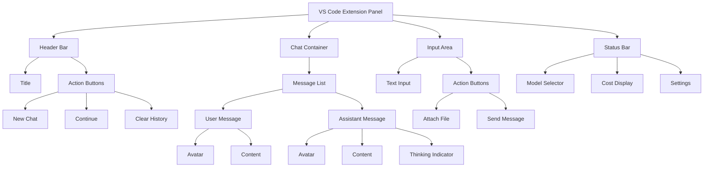
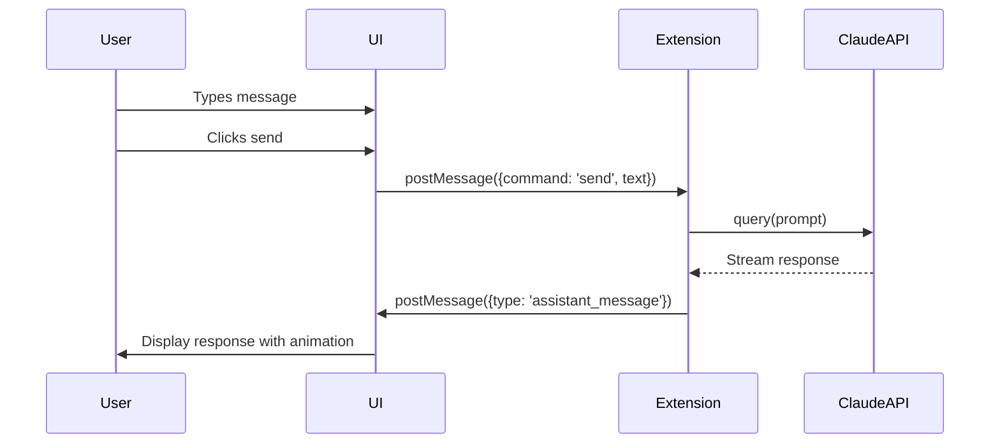

# Claude Code UI Design

## Component Hierarchy



## UI Flow



## Visual Design Elements

### Color Palette (VS Code Dark Theme)
- **Background**: #1e1e1e (editor)
- **Panel Background**: #252526
- **Input Background**: #3c3c3c
- **Border**: #464647
- **Text**: #cccccc
- **Accent**: #007acc (VS Code blue)
- **User Avatar**: #007acc
- **Claude Avatar**: #4a90e2

### Typography
- **Font Family**: -apple-system, BlinkMacSystemFont, 'Segoe UI'
- **Base Size**: 14px
- **Code Font**: Consolas, Monaco, 'Courier New'
- **Code Size**: 13px

### Layout Specifications
```
┌─────────────────────────────────────┐
│ Header (40px)                       │
├─────────────────────────────────────┤
│                                     │
│ Chat Messages                       │
│ (Flex: 1, Scrollable)              │
│                                     │
│ • 20px padding                      │
│ • 20px gap between messages         │
│ • Max width: 800px (centered)       │
│                                     │
├─────────────────────────────────────┤
│ Input Area (120px)                  │
│ • Multi-line textarea               │
│ • Action buttons overlay            │
├─────────────────────────────────────┤
│ Status Bar (32px)                   │
└─────────────────────────────────────┘
```

### Interactive Elements

1. **Message Animation**
   - Fade in from bottom
   - 300ms duration
   - Ease-in timing

2. **Thinking Indicator**
   - 3 dots pulsing animation
   - 1.4s cycle time
   - Sequential delay

3. **Input Field**
   - Auto-resize up to 200px
   - Blue border on focus
   - Shift+Enter for new line

4. **Hover States**
   - Buttons: Background color change
   - Messages: Slight elevation
   - Code blocks: Copy button appears

### Responsive Behavior
- Minimum width: 300px
- Maximum message width: 800px
- Sidebar mode: Adjusts to panel width
- Mobile-friendly: Touch targets 44px minimum